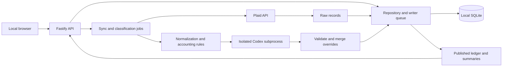

# Respect Money — Architecture and delivery plan

Updated 2026-09-25 to match the implemented SQLite application. The original M0–M6 plan is preserved in Git history. [Product requirements](PRD.md) define behavior; [Implementation status](IMPLEMENTATION_STATUS.md) distinguishes automated evidence from live integration validation.

## Stack and process model

| Layer | Implementation |
| --- | --- |
| Web | React, TypeScript, Vite, React Router |
| State and tables | TanStack Query and Table; URL-based navigation/filter state |
| API | Fastify on Node.js 24+; development/CI use Node.js 26 |
| Validation | Zod schemas and JSON Schema for model output |
| Storage | Built-in `node:sqlite`, in-memory snapshots, serial writer queue |
| Banking | Plaid SDK and React Plaid Link |
| Classification | Installed Codex CLI, spawned without a shell |
| Verification | TypeScript, ESLint, Vitest, Fastify injection, Playwright |

Development serves Vite on port 5173 and proxies `/api/` to the saved backend port, initially 3001. The production build serves `dist/web` through Fastify. The entry point binds to `127.0.0.1`; Host and Origin checks restrict browser requests. There is no application authentication for public deployment.

## Code map

| Directory/file | Responsibility |
| --- | --- |
| `src/web/App.tsx` | Routes, global navigation, and application layout |
| `src/web/features/` | Accounting, overview, settings, sync, and wealth views |
| `src/web/api.ts` | Browser API calls and language headers |
| `src/i18n/` | English/Chinese catalogs, language and formatting helpers |
| `src/server/routes/` | Request validation and public response boundaries |
| `src/server/domain/` | Ledger, overview, duplicate detection, coverage, wealth rules |
| `src/server/services/` | Connections, jobs, synchronization, classification, wealth |
| `src/server/storage/` | SQLite, repository state, migrations, backups, locks |
| `src/server/integrations/` | Plaid gateway and Codex process/schema adapters |
| `src/shared/` | Shared schemas, stable identifiers, monetary/date contracts |
| `scripts/` | CLI checks, migration/backup commands, isolated browser test server |
| `tests/fixtures/` | Fictional provider/model data |
| `tests/e2e/` | Browser workflows |
| `docs/` | Versioned documentation and static product illustration |
| `data/` | Ignored local financial data; never an application static root |

## Data invariants

Stable local account IDs map to provider account and Item IDs; institution names and last four digits are not unique identities. Transaction sources are `manual`, `plaid_transactions`, or `plaid_investments`. Raw payloads, manual overrides, cached classifications, and published transactions remain separate objects.

Cash flow is signed integer cents. Source adapters normalize provider signs; aggregation does not use floating-point currency arithmetic. ISO posting dates determine ledger months directly. Pacific calendar dates determine synchronization bounds and daily wealth snapshots.

Splits conserve signed amounts and replace the parent only for aggregation. Deleted bank records cannot reappear merely because an old override remains. Optimistic revisions reject stale browser edits. Source facts are not overwritten by the model.

`Repository` clones a snapshot for a change, validates it, commits changed SQLite entities plus the revision atomically, then installs the new in-memory state. The writer lock protects against simultaneous app/migration/backup processes. Startup verifies database identity, integrity, foreign keys, and business structure; it preserves published snapshots and interrupts unfinished jobs. See [SQLite storage](SQLITE_STORAGE.md).

## Banking and background work

A unified Link flow initializes Transactions and requests additional consent for Investments. Existing connections use update mode for account selection and additional consent. Tokens remain in private database tables. Browser status omits access tokens and cursors. Disconnect removes the Item through the gateway and atomically deletes the connection, its accounts, source records, classifications, overrides, published rows, coverage, and related jobs. Balance snapshots are scrubbed and recalculated; account-dependent reclassification previews expire. Unrelated accounts and manual assets remain. Startup removes disconnected accounts retained by older versions.

Explicit `consented_products` authorizes attempting a product endpoint even when that product is absent from `products`, `billed_products`, and `available_products`. Availability alone never grants consent. Products requested through additional consent can be initialized by their first endpoint call, as described in [Plaid's product initialization guide](https://plaid.com/docs/link/initializing-products/). Ledger synchronization and wealth refresh re-read consent so previously filtered connections recover without relinking. Provider errors distinguish unavailable products from data that is still being prepared.

At startup, connections retaining the old missing-data-access warning are checked against current Item metadata. The warning is cleared only when explicit consent covers all enabled accounts and the Item has no error. Failed or inconclusive checks preserve the warning. This check does not initialize products, sync transactions, classify records, or rewrite historical jobs. Settings requests reconnection only for `login_required`; other errors display "Needs attention."

Transactions synchronization consumes all pages before committing the cursor, restarts pagination on provider mutation, applies removals, and handles corrections outside the selected month. Requested ranges are merged rather than used to delete previously enabled history. Investments reconciles complete requested ranges, pagination, cancellations, securities references, and reinvestments. Partial failures are explicit.

Jobs are persisted and deduplicated while active. Browser refresh does not cancel backend work. Classification failures leave the prior published ledger available and mark affected accounts stale. Explicit rule publication provides a fallback. Wealth refresh has its own service, preserves stale balances on errors, and saves daily snapshots after eligible updates.

## Classification boundary

The runner passes an argument array to `spawn`, supplies input on stdin, and works from a temporary directory outside the repository. It reuses CLI login discovery but passes only an allowlist of OS environment variables; Plaid credentials are not forwarded. User configuration/rules are disabled, tools are disabled, a read-only sandbox is requested, and unexpected tool events cause failure. Temporary schema/result files are removed after completion. A read-only sandbox alone is not a guarantee that all other local files are inaccessible.

The ordinary classifier batches at most 50 records / 24 KB and checks that every temporary reference appears exactly once, enums are valid, cash flow directions are consistent, and no extra fields are returned. Deterministic normalization and manual decisions remain authoritative. Normal sync reuses saved classifications by transaction identity; explicit reanalysis can replace them. New classifications record source hash and classifier configuration/version.

Pattern-based reclassification scans at most 1,000 candidates per model call, validates sparse matches and the reviewed count, retries invalid batches once, and builds a temporary preview. Applying selected matches verifies rule and transaction versions and writes overrides atomically. Preview state is in memory for up to one hour; rules are stored locally.

## API entry points

Route modules and shared Zod schemas are the authoritative request/response contracts. Representative implemented endpoints are:

| Endpoint | Purpose |
| --- | --- |
| `GET /api/health` | Local service readiness |
| `GET /api/settings/status` | Integration status, connections, recent jobs |
| `GET /api/settings`, `PUT /api/settings` | Read public configuration and save revision-checked changes |
| `GET /api/settings/models` | Available CLI models |
| `GET /api/accounts`, `POST /api/accounts/manual`, `PATCH /api/accounts/:id` | Account management |
| `POST /api/plaid/link-token`, `POST /api/plaid/complete` | Begin and complete Link |
| `DELETE /api/plaid/connections/:id` | Disconnect and delete associated local account data |
| `GET /api/accounting/months`, `/summary`, `/transactions`, `/coverage`, `/overview` | Ledger queries under `/api/accounting` |
| `POST /api/transactions/manual`, `PATCH /api/transactions/manual/:id` | Manual records |
| `PUT /api/transactions/:id/overrides`, `/splits`, `/match` | Edit, split, or link duplicates |
| `POST /api/jobs`, `GET /api/jobs`, `POST /api/jobs/:id/retry` | Queue, inspect, and retry sync/classification |
| `POST /api/accounting/publish-rules` | Publish deterministic fallback results |
| `/api/reclassification/rules`, `/api/reclassification/previews/...` | Explicit rule scan and apply workflow |
| `/api/wealth`, `/api/wealth/assets`, `/api/wealth/history`, `/api/wealth/refresh` | Wealth queries and updates |

Date ranges include both endpoints. Error responses are localized at the request boundary; unexpected server errors are generic rather than exposing raw upstream failures. Language negotiation never changes global server state.

## Original milestones and current work

| Milestone | Delivered locally | External boundary |
| --- | --- | --- |
| M0: foundation | Build/dev scripts, schemas, health API, isolated classifier contract | CLI capabilities depend on the installed version |
| M1: persistence and rules | Durable ledger, monetary rules, splits, corrections, recovery | JSON storage was subsequently replaced with SQLite |
| M2: manual workspace | Accounts, transactions, filtering, edits, review, desktop/mobile UI | No bank access required |
| M3: bank synchronization | Link, incremental sync, coverage, retries, duplicates | Actual institution permissions require live validation |
| M4: investment cash activity | Pagination, reconciliation, cash income/fees, reinvestment rules | Live provider records require validation |
| M5: classification | Batching, validation, cache, manual precedence, fallback | Model access and output quality depend on configuration |
| M6: local acceptance | Automated integration/browser tests, docs, backups, CI | Fixtures do not certify real institution access |

Subsequent delivered work includes SQLite migration, bilingual UI, monthly overview, UI-managed settings, example-based reclassification, unified connections, wealth/history, account merging, and disconnection. Portfolio performance, receipt ingestion, and public hosting remain outside scope.

Run `npm run check`, then `npm run test:e2e` after installing Chromium. Tests must use temporary data and fictional services. Use `npm run codex:check` only as a separate optional live CLI test. Follow [Contributing](../CONTRIBUTING.md) and [AGENTS.md](../AGENTS.md) for repository workflow.
